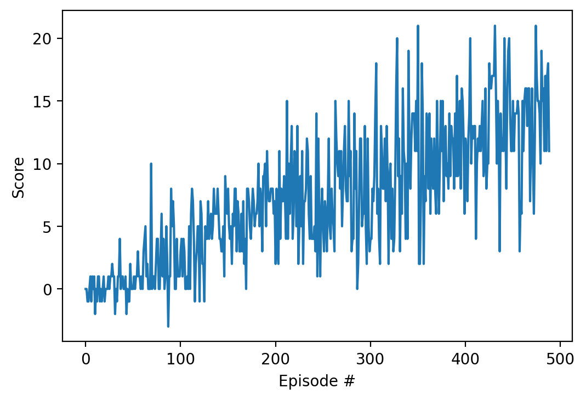

# Report Project 1: Navigation
----

## Learning Algorithm
This project is based on the Deep-Q Algorithm to train the agent.

### Neural Network Architecture
- Input: state-size 37x1
- Full Connected (hidden) layer with ReLu activation: 64 nodes
- Full Connected (hidden) layer with ReLu activation: 64 nodes
- Fully Connected (output) layer: 4 nodes (dimension of actions space)

### Hyperparameters
- replay buffer size: 1e5
- minibatch size: 64
- discount factor (gamma): 0.9
- soft update of target parameters (tau): 1e-3
- learning rate (lr): 1e-3
- how often neural network is updated (update_every): 4
- Epsilon greedy start value: 1.0
- Epsilon greedy end value: 0.01
- Epsilon greedy decay value: 0.995
- maximum number of episodes to be trained: 1000
- maximum number of timesteps per episode: 400

## Results: Plot of Rewards
Using the described model and its hyperparameters, the Deep-Q agent solved the tasks in **389 episodes**, meaning the agent reached an average score of +13 over 100 consecutive episodes at this point in time.

The following plot provides an overview over the reached scores during training:

## Ideas for Future Work
Potential future work could be done addressing the following points:
- Try further neural network architectures
- implement improved algorithms such as
  - double DQN
  - prioritzed experienced replay
  - dueling DQN 